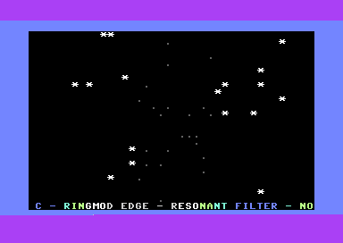

# Berlin Subway Eyecandy

Commodore 64 demo that turns a Berlin airport-to-hotel journey into a continuous visual trip. It combines 28 sequenced effects, station title cards, a scrolling narrative, raster transitions, and a shared three-voice SID score.

## Build and run

Requires [ACME](https://sourceforge.net/projects/acme-crossass/) and VICE:

```sh
cd src
acme -f cbm -o ../build/berlin_subway_eyecandy.prg subway.s
x64sc -autostartprgmode 1 -autostart ../build/berlin_subway_eyecandy.prg
```

The assembler must run from `src/` because the source embeds the wireframe atlas files. The emitted program is PAL-oriented and starts at `SYS 2061`.

## Contents

- `src/subway.s` — complete ACME source and effect/music engine.
- `src/wire_cube_chars.bin`, `src/wire_cube_mask.bin` — bundled wireframe data.
- `build/berlin_subway_eyecandy.prg` — reproducible build artifact.
- `docs/FUNCTIONS.md` — entry points and subsystem guide.
- `docs/history/` — supplied audit and change notes.

The original archive described a four-minute loop with stations including Flughafen BER, Alexanderplatz, Kottbusser Tor, and Golden Heart Hotel. Keyboard controls in the source pause the scroller with Space and adjust speed with `+`/`-`.

## License

GPL-3.0-or-later. See [LICENSE](LICENSE).

## Live VICE capture


